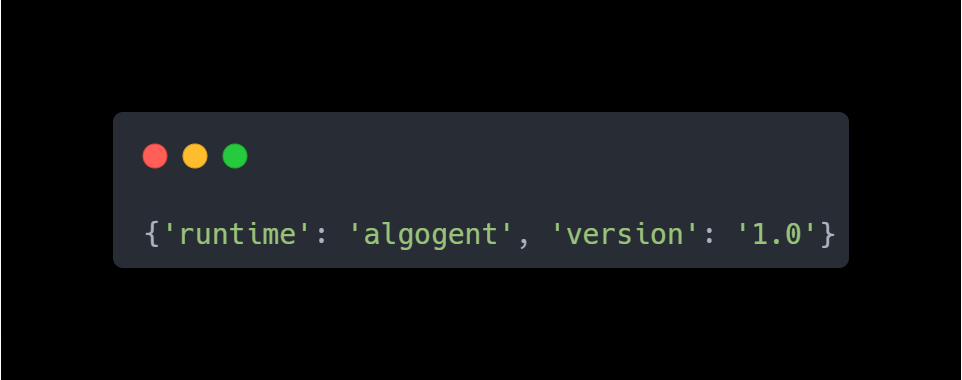
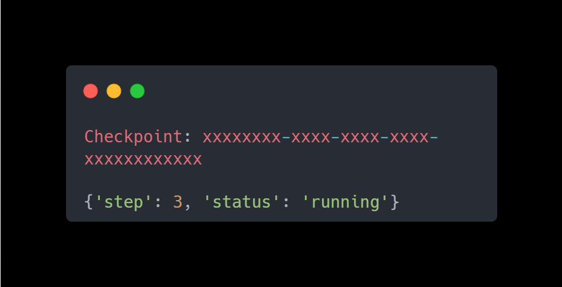
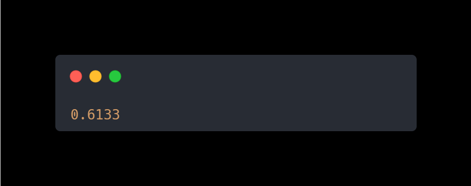
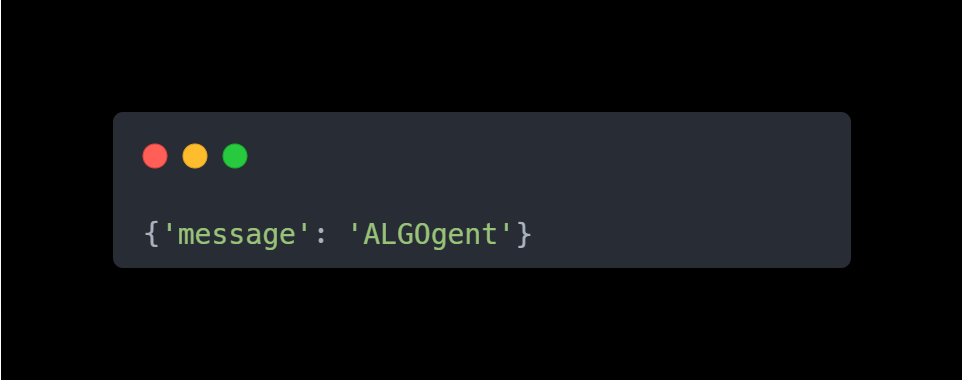
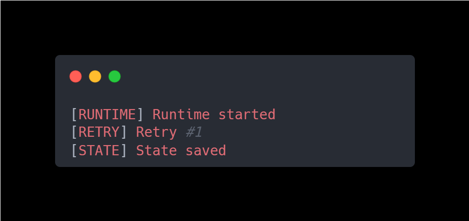

# ALGOgent Runtime SDK v1 — Quick Start

> Verify your installation by running each module test, then run the full examples.

---

## Prerequisites

- Python 3.10+
- Project cloned and dependencies installed:

```bash
git clone https://github.com/your-username/algogent-runtime.git
cd algogent-runtime
pip install -r requirements.txt
```

---

## Step 1 — Test State Manager

```bash
python -m algogent.test.test_state
```

**Expected Output:**



---

## Step 2 — Test Checkpoint Engine

```bash
python -m algogent.test.test_checkpoint
```

**Expected Output:**



> UUID akan berbeda setiap run — itu normal.

---

## Step 3 — Test Confidence Engine

```bash
python -m algogent.test.test_confidence
```

**Expected Output:**



> Angka mungkin berbeda — confidence score bersifat probabilistik.

---

## Step 4 — Test Event Bus

```bash
python -m algogent.test.test_events
```

**Expected Output:**



---

## Step 5 — Test Runtime Logger

```bash
python -m algogent.test.test_logger
```

**Expected Output:**



---

## Step 6 — Run All Examples

```bash
python -m algogent.examples.ecommerce
python -m algogent.examples.ai_agent
python -m algogent.examples.automation
```

---

## Generated Files

Setelah menjalankan examples, ALGOgent akan membuat:

```text
algogent_state.json          ← runtime state snapshot
.algogent_checkpoints/       ← checkpoint recovery data
```

Tambahkan ke `.gitignore`:

```gitignore
__pycache__/
*.pyc
algogent_state.json
.algogent_checkpoints/
.venv/
venv/
.env
```

---

Semua test passed? Lanjut ke [README.md](README.md) untuk dokumentasi lengkap.
