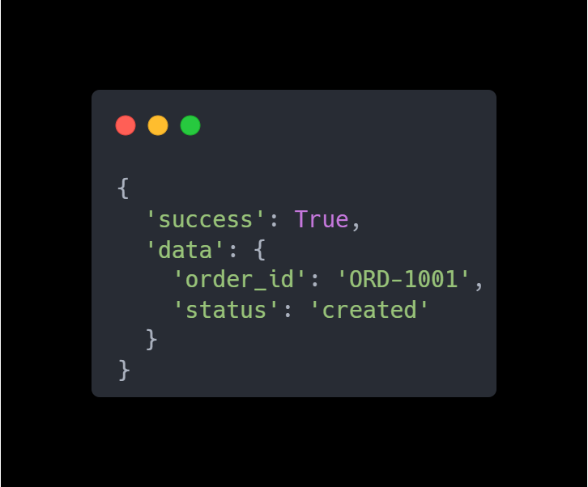
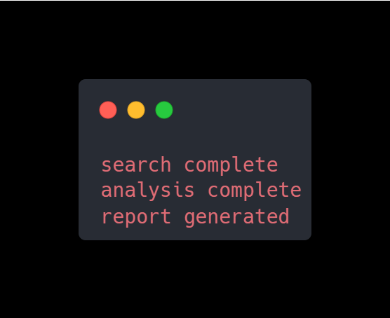
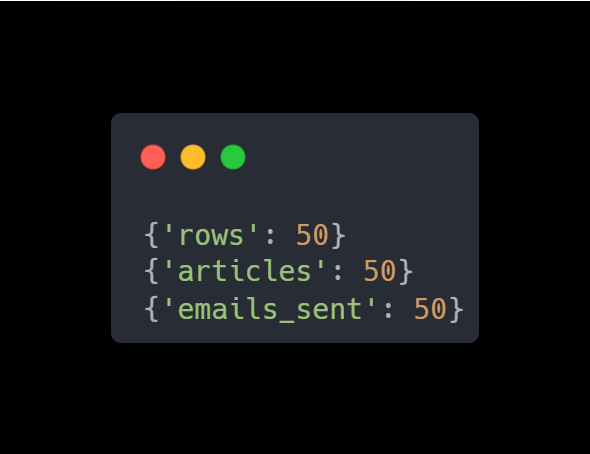

# ALGOgent Runtime SDK v1

> Lightweight Runtime Intelligence SDK for Python Automation, AI Agents, and Resilient Workflows.

[](https://www.python.org/)
[](LICENSE)
[]()
[]()
[]()

---

## What is ALGOgent?

ALGOgent is a self-contained Python SDK designed for building **resilient workflows**, **AI agent pipelines**, and **automation systems** — without depending on external services or infrastructure.

It gives your Python code:
- Automatic retry with smart backoff
- State persistence across runs
- Checkpoint & recovery for long tasks
- Confidence scoring for decision flows
- Lightweight in-process event bus
- Structured runtime logging & metrics

---

## Features

| Feature | Description |
|---|---|
| **Runtime Execution Engine** | Orchestrates task execution with lifecycle hooks |
| **Retry Engine with Backoff** | Configurable retry logic with exponential backoff |
| **State Persistence** | Auto-saves runtime state to `algogent_state.json` |
| **Checkpoint Recovery** | Resume long jobs from `.algogent_checkpoints/` |
| **Confidence Scoring** | Evaluate decision confidence in agent workflows |
| **Event Bus System** | Decouple components with publish/subscribe events |
| **Structured Logging** | Tagged log levels: `[RUNTIME]`, `[RETRY]`, `[STATE]` |
| **Runtime Metrics** | Track execution stats without external tooling |

---

## Installation

```bash
git clone https://github.com/your-username/algogent-runtime.git
cd algogent-runtime
pip install -r requirements.txt
```

---

## Project Structure

```text
algogent-runtime/
¦
+-- README.md
+-- QUICKSTART.md
+-- requirements.txt
¦
+-- algogent/
    +-- core/               # Runtime engine, result types, exceptions
    ¦   +-- runtime.py
    ¦   +-- result.py
    ¦   +-- exceptions.py
    ¦
    +-- retry/              # Retry engine with backoff strategies
    ¦   +-- retry_engine.py
    ¦   +-- backoff.py
    ¦
    +-- state/              # State manager, checkpoint, storage
    ¦   +-- state_manager.py
    ¦   +-- checkpoint.py
    ¦   +-- storage.py
    ¦
    +-- confidence/         # Confidence scoring engine
    ¦   +-- confidence_engine.py
    ¦
    +-- events/             # Event bus and event type definitions
    ¦   +-- event_bus.py
    ¦   +-- event_types.py
    ¦
    +-- observability/      # Logger and runtime metrics
    ¦   +-- logger.py
    ¦   +-- metrics.py
    ¦
    +-- examples/           # Runnable workflow examples
    ¦   +-- ecommerce.py
    ¦   +-- ai_agent.py
    ¦   +-- automation.py
    ¦
    +-- test/               # Unit tests per module
        +-- test_state.py
        +-- test_checkpoint.py
        +-- test_confidence.py
        +-- test_events.py
        +-- test_logger.py
```

---

## Quick Start

### 1. E-commerce Workflow

```bash
python -m algogent.examples.ecommerce
```

**Output:**



---

### 2. AI Agent Workflow

```bash
python -m algogent.examples.ai_agent
```

**Output:**



---

### 3. Automation Workflow

```bash
python -m algogent.examples.automation
```

**Output:**



---

## Running Tests

```bash
# Test State Manager
python -m algogent.test.test_state

# Test Checkpoint Engine
python -m algogent.test.test_checkpoint

# Test Confidence Engine
python -m algogent.test.test_confidence

# Test Event Bus
python -m algogent.test.test_events

# Test Runtime Logger
python -m algogent.test.test_logger
```

> See [QUICKSTART.md](QUICKSTART.md) for expected output of each test.

---

## Runtime State & Checkpoints

ALGOgent automatically creates these files during execution:

```text
algogent_state.json          ? runtime state snapshot
.algogent_checkpoints/       ? recovery checkpoints for long jobs
```

Add both to `.gitignore`:

```gitignore
__pycache__/
*.pyc
algogent_state.json
.algogent_checkpoints/
.venv/
venv/
.env
```

---

## Requirements

- **Python 3.10+**

```bash
pip install -r requirements.txt
```

| Package | Version | Purpose |
|---|---|---|
| `pydantic` | = 2.7.0 | Runtime data validation |
| `aiosqlite` | = 0.20.0 | Future SQLite backend support |
| `pytest` | = 8.2.0 | Test runner |
| `pytest-asyncio` | = 0.23.0 | Async test support |

Optional stdlib modules used internally: `asyncio`, `json`, `uuid`

---

## License

MIT License — see [LICENSE](LICENSE) for details.